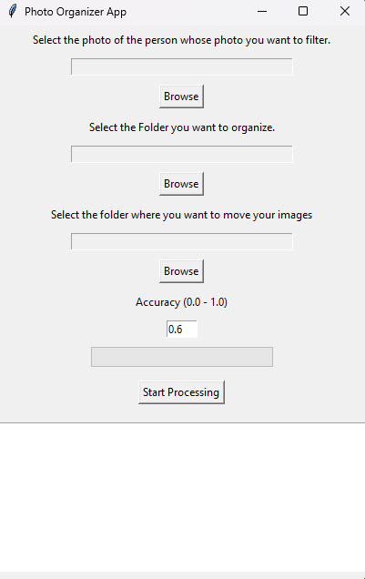

# photo-organizer

## Descripción General

Photo organizer App es una herramienta de Python que utiliza el reconocimiento facial para organizar sin esfuerzo su colección de fotos. Simplemente elija una foto de referencia, seleccione la carpeta a clasificar y designe una carpeta de destino. La aplicación aprovecha la aceleración por GPU para obtener una velocidad óptima, garantizando una gestión eficiente de las fotos. Simplifique la clasificación de sus imágenes con ella.

## Tabla de Contenidos

- [Motivación](#motivation)
- [Descripción del Proyecto](#project-description)
- [Instalación y Uso](#installation-and-usage)
- [Cómo Ejecutar](#how-to-install-and-run)
- [Características](#features)
- [Créditos](#credits)
- [Licencia](#license)

## Captura de Pantalla del Proyecto



## Motivación

La motivación detrás de este proyecto es simplificar el proceso de organizar una gran cantidad de imágenes clasificándolas automáticamente basándose en el rostro de una persona específica.

## Descripción del Proyecto

Esta aplicación ofrece una GUI intuitiva que permite a los usuarios:

- Seleccionar la foto de la persona objetivo.
- Elegir la carpeta que contiene las imágenes desorganizadas.
- Especificar la carpeta de destino para las imágenes coincidentes.
- Establecer la tolerancia o el nivel de precisión para la coincidencia facial.

Luego, la aplicación procesa las imágenes, moviendo las coincidentes a la carpeta de salida especificada.

## Instalación y Uso

### Cómo Instalar y Ejecutar

1. Python
   Si no tiene Python instalado en su equipo, siga estos pasos:
 Para Windows:
   Descargue la última versión de Python desde python.org
   Durante la instalación, asegúrese de marcar la casilla que dice "Add Python to PATH".
 Para macOS y Linux:
   Python suele estar preinstalado en macOS y en muchas distribuciones de Linux. Abra una terminal y escriba python3 o python para
   verificar si ya está instalado.
   Si no está instalado, puede instalarlo utilizando el gestor de paquetes de su sistema.

3. Clone el repositorio:

    ```bash
    git clone https://github.com/5h4d0wn1k/photo-organizer.git
    cd photo-organizer
    ```

4. Instale las dependencias requeridas:

    ```bash
    pip install -r requirements.txt
    ```

5. Ejecute la aplicación:

    ```bash
    python main.py
    ```
    
### Requisitos
 Solo si desea hacerlo manualmente 
- Python 3.6 o superior
- OpenCV (`pip install opencv-python`)
- Face Recognition (`pip install face-recognition`)
- dlib (`pip install dlib`)
- tqdm (`pip install tqdm`)
- numpy (`pip install numpy`)
- scikit-learn (`pip install scikit-learn`)
- scikit-image (`pip install scikit-image`)
- pillow (`pip install pillow`)
- tkinter (`pip install tk`)

### Cómo Usar el Proyecto

1. Seleccione la foto de la persona objetivo.
2. Elija la carpeta que contiene las imágenes desorganizadas.
3. Especifique la carpeta de destino para las imágenes coincidentes.
4. Establezca el nivel de tolerancia (0.0 - 1.0) para la coincidencia facial.
5. Haga clic en el botón "Start Processing" para iniciar el proceso de clasificación de imágenes.

## Características

- Clasificación automática de imágenes basada en el reconocimiento facial.
- GUI intuitiva para una interacción sencilla.
- Barra de progreso para rastrear el estado del procesamiento.
- Manejo de errores para una experiencia de usuario fluida.

## Créditos

- Desarrollado por [Nikhil Nagpure]

## Licencia

Este proyecto está licenciado bajo la [Apache 2.0](LICENSE).
