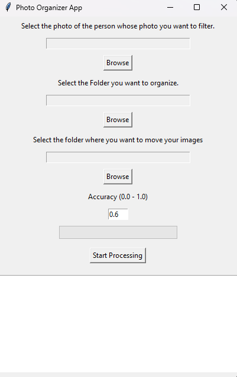

# photo-organizer

## Overview

Photo organizer App is a Python tool that uses facial recognition to effortlessly organize your photo collection. Simply choose a reference photo, select the folder to sort, and designate a destination folder. The app leverages GPU acceleration for optimal speed, ensuring efficient photo management. Simplify your image sorting with it.

## Table of Contents

- [Motivation](#motivation)
- [Project Description](#project-description)
- [Installation and Usage](#installation-and-usage)
- [How to Run](#how-to-install-and-run)
- [Features](#features)
- [Credits](#credits)
- [License](#license)

## Project Screenshot



## Motivation

The motivation behind this project is to simplify the process of organizing a vast number of images by automatically sorting them based on the face of a specified person.

## Project Description

This application offers a user-friendly GUI that allows users to:

- Select the target person's photo.
- Choose the folder containing unorganized images.
- Specify the destination folder for matching images.
- Set the tolerance or accuracy level for face matching.

The app then processes the images, moving the matching ones to the specified output folder.

## Installation and Usage

### How to Install and Run

1. Python
   If you don't have Python installed on your machine, follow these steps:
 For Windows:
   Download the latest version of Python from python.org
   During installation, make sure to check the box that says "Add Python to PATH.
 For macOS and Linux:
   Python is usually pre-installed on macOS and many Linux distributions. Open a terminal and type python3 or python to
   check if it's already installed.
   If not installed, you can install it using the package manager for your system.

3. Clone the repository:

    ```bash
    git clone https://github.com/5h4d0wn1k/photo-organizer.git
    cd photo-organizer
    ```

4. Install the required dependencies:

    ```bash
    pip install -r requirements.txt
    ```

5. Run the application:

    ```bash
    python main.py
    ```
    
### Requirements
 Only if you want to do it manually 
- Python 3.6 or higher
- OpenCV (`pip install opencv-python`)
- Face Recognition (`pip install face-recognition`)
- dlib (`pip install dlib`)
- tqdm (`pip install tqdm`)
- numpy (`pip install numpy`)
- scikit-learn (`pip install scikit-learn`)
- scikit-image (`pip install scikit-image`)
- pillow (`pip install pillow`)
- tkinter (`pip install tk`)

### How to Use the Project

1. Select the target person's photo.
2. Choose the folder containing unorganized images.
3. Specify the destination folder for matching images.
4. Set the tolerance level (0.0 - 1.0) for face matching.
5. Click the "Start Processing" button to initiate the image sorting process.

## Features

- Automatic image sorting based on face recognition.
- User-friendly GUI for easy interaction.
- Progress bar for tracking processing status.
- Error handling for a smooth user experience.

## Credits

- Developed by [Nikhil Nagpure]

## License

This project is licensed under the [Apache 2.0](LICENSE).

